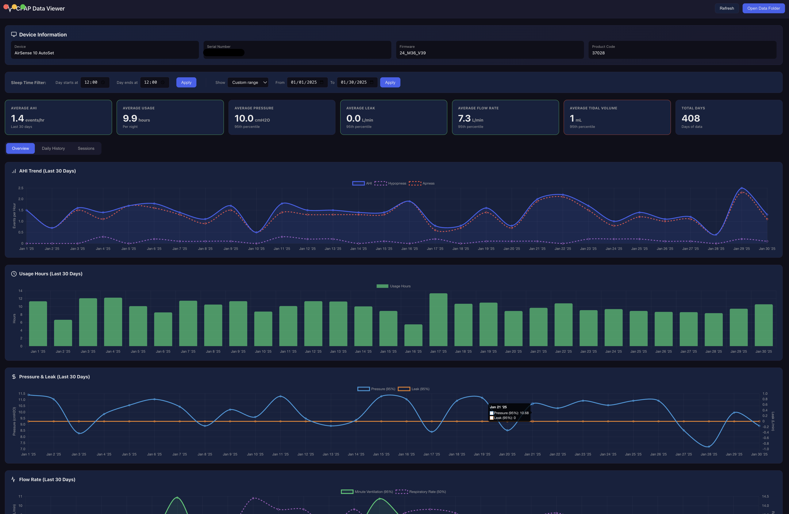

# CPAP Data Viewer

An Electron application for decoding and displaying ResMed CPAP data.



## Features

### Dashboard Overview
- **Device Information**: View your CPAP device details (model, serial number, firmware)
- **Stats Cards**: At-a-glance averages for AHI, usage, pressure, leak, flow rate, tidal volume, SpO2, and pulse (color-coded health indicators)
- **Configurable Time Range**: View data for 7, 14, 30, 60, 90, 180, 365 days, all data, or custom date range

### Interactive Trend Charts
- **AHI Trend**: Apnea-Hypopnea Index with hypopneas and apneas overlay
- **Usage Hours**: Daily usage with 4-hour compliance threshold line
- **Pressure & Leak**: Dual-axis chart showing pressure and leak rates
- **Flow Rate**: Minute ventilation and respiratory rate
- **Tidal Volume**: 50th and 95th percentile breathing volume
- **SpO2**: Blood oxygen saturation (requires oximeter)
- **Pulse Rate**: Heart rate metrics (requires oximeter)

### Day Detail View
- Click any data point on charts or any row in the history table to view comprehensive daily data
- Detailed breakdown of respiratory events, pressure, leak, and respiratory metrics
- Oximetry data when available

### Session Browser
- Browse individual therapy sessions
- View detailed waveform data for each session
- Session-level signal analysis

### Data Management
- **Sleep Time Filter**: Configure day boundaries for accurate sleep night grouping (noon-to-noon default)
- **Custom Date Range**: Select specific date ranges with From/To date pickers
- **Export-ready**: All data displayed in easy-to-read formats

## Supported Devices

- ResMed AirSense 10 series
- ResMed AirSense 11 series
- Other ResMed devices using EDF format

## Installation

```bash
cd cpap-viewer
npm install
```

## Usage

```bash
npm start
```

The app will automatically load data from the `NO NAME` directory (your CPAP SD card) if present.

To load data from a different location, click "Open Data Folder" and select your CPAP data directory.

## Data Structure

The app expects ResMed CPAP data with:
- `STR.edf` - Summary statistics file
- `DATALOG/` - Directory containing daily session data
- `Identification.tgt` - Device identification file

## Understanding Your Data

### AHI (Apnea-Hypopnea Index)
- **< 5**: Normal/Excellent (green)
- **5-15**: Mild (yellow)
- **15-30**: Moderate
- **> 30**: Severe (red)

### Usage Hours
- **4+ hours**: Good compliance (green)
- **2-4 hours**: Moderate (yellow)
- **< 2 hours**: Low (red)

### Leak Rate (95th percentile)
- **< 24 L/min**: Normal (green)
- **24-36 L/min**: Elevated (yellow)
- **> 36 L/min**: High (red) - check mask fit

### Flow Rate (Minute Ventilation)
- **5-10 L/min**: Normal (green)
- **4-5 or 10-12 L/min**: Slightly outside normal (yellow)
- **< 4 or > 12 L/min**: Concerning (red)

### Tidal Volume
- **400-600 mL**: Normal for adults (green)
- **300-400 or 600-700 mL**: Slightly outside normal (yellow)

### SpO2 (Blood Oxygen)
- **95-100%**: Normal (green)
- **90-94%**: Concerning (yellow)
- **< 90%**: Low (red)

### Pulse Rate
- **50-100 bpm**: Normal resting (green)
- **40-50 or 100-110 bpm**: Outside normal (yellow)

## Development

Built with:
- Electron 28
- Chart.js 4.4
- Custom EDF parser for medical data format

## License

MIT
